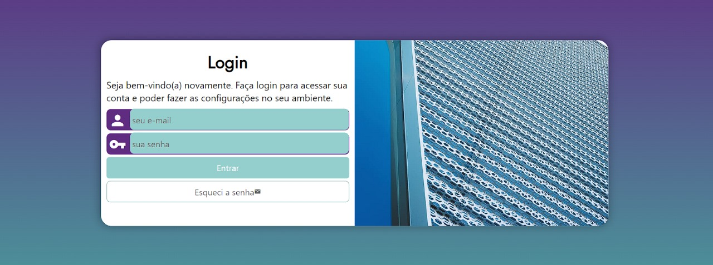

# Projeto de Tela de Login

## Descrição
Este é um projeto de tela de login criado para fins de estudo e prática em desenvolvimento web. A interface é simples e moderna, com campos para e-mail e senha, além de um botão para recuperação de senha.



## Funcionalidades
- Campo para entrada de e-mail.
- Campo para entrada de senha.
- Botão para enviar os dados de login.
- Link para recuperação de senha.

## Tecnologias Utilizadas
- HTML
- CSS

## Como Usar
1. Clone este repositório:
   ```bash
   git clone https://github.com/anabxrges/projeto-login.git
   ```
2. Navegue até o diretório do projeto:
   ```bash
   cd projeto-login
   ```
3. Abra o arquivo `index.html` em seu navegador para visualizar a tela de login.

## Estrutura do Projeto
```
projeto/
├── index.html          
├── README.md           
├── .gitattributes       
├── /estilo             
│   ├── style.css        
│   └── media-query.css  
├── /fontes              
│   ├── Expressway.otf
│   └── Renner.ttf
├── /imagens             
│   ├── imagem-projeto.png
│   └── metal.jpg
```
## Melhorias Futuras

- Implementar validação de formulário com JavaScript.
- Adicionar integração com backend para autenticação real.

## Contribuição
Contribuições são bem-vindas! Sinta-se à vontade para abrir uma issue ou enviar um pull request.

